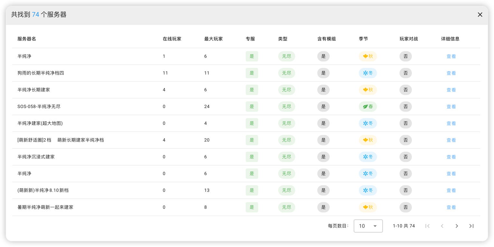
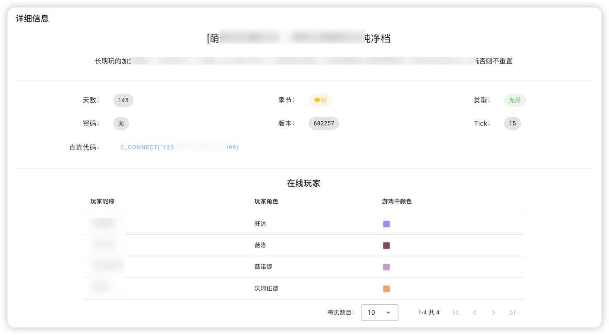

## 饥荒服务器查询

闲暇时光写了一个小工具，可部署在自己的环境，供自己和他人查询饥荒服务器

欢迎品尝：[饥荒服务器查询](http://8.137.107.46:7777/)

#### 首页

可以选择多个饥荒大厅，输入房间名进行查询，支持模糊匹配


#### 查询结果

显示一些基本信息



点击查看详细信息，可以显示直连代码、在线玩家和模组信息




#### 使用方法

下载release中的二进制文件后，输入：

```shell
nohup ./dst-search -l 80 &
```

`-l 80` 为暴露端口，默认为7777，可按需更改

